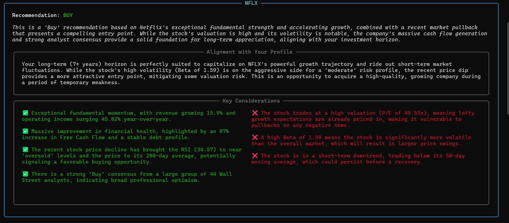
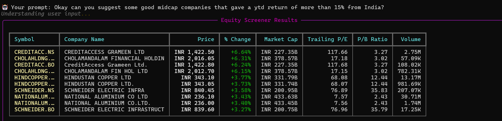
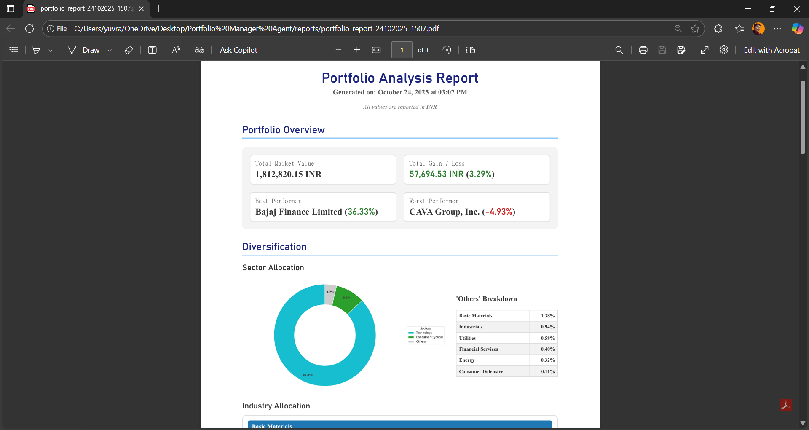
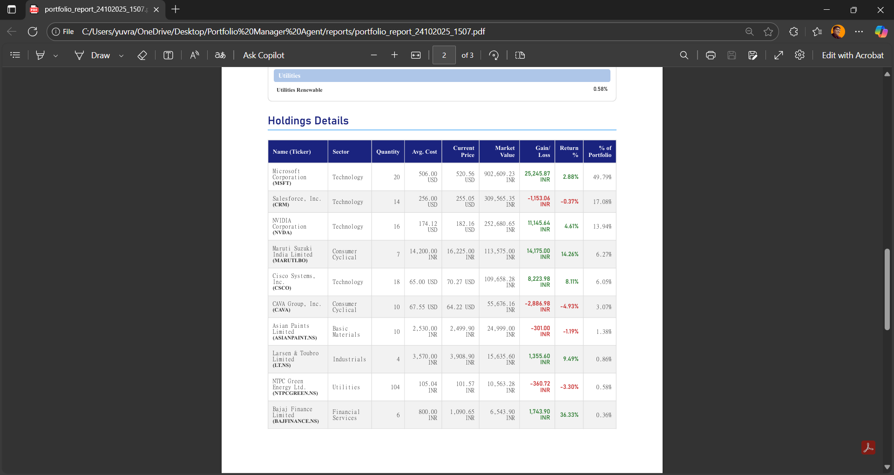
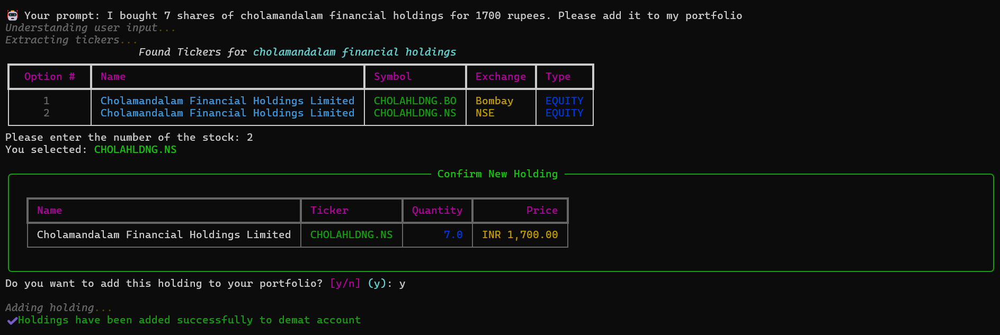
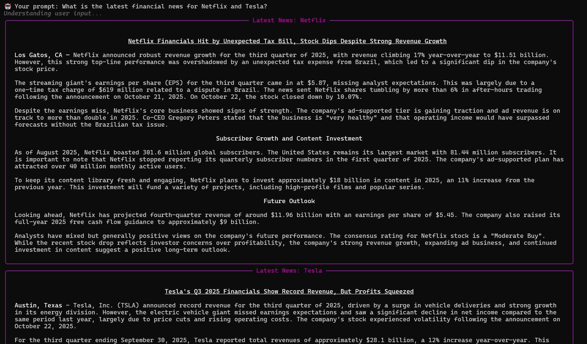
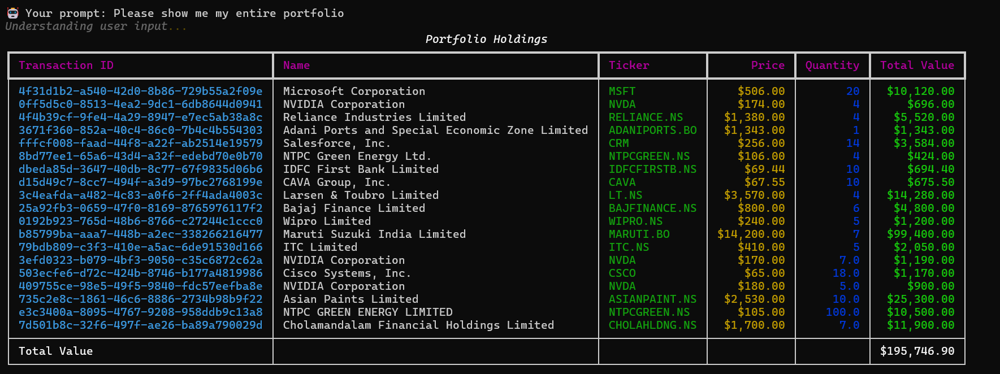

# Portfolio Manager Agent

<p align="center"><b>An advanced Financial AI agent built with LangGraph</b></p>
<p align="center">
This agent acts as a personal financial advisor, understanding natural language commands to provide deep market analysis, manage portfolios, and generate personalized investment advice.
</p>

<p align="center">


</p>

---

## Screenshots

**Stock Analysis**
  
*Caption: Get analysis of stocks and funds tailored to your profile*  

**Stock Screener**  

*Caption: Complex financial queries are handled by the stock screener tool*  

**Portfolio Report** 

 
*Caption: Generate detailed reports of your investment portfolio*  

**Portfolio Management** 
 
*Caption: Perform CRUD operations using natural language* 

**Financial News**

*Caption: Ask for up to date financial news*

**View Holdings**

*Caption: View your holdings on a prompt*

---

## Project Demo

Watch a full walkthrough and demonstration of the project's capabilities on [Will be updated soon](YOUR_YOUTUBE_LINK_HERE).

---

## About The Project

This project is a sophisticated, multi-tool financial agent built on **LangGraph**, designed to function as an expert financial advisor with a command line chat interface.

The core agent (in `agents/process_input.py`) acts as a "supervisor" or "router," analyzing the user's prompt and personal profile to select the best tool for the request. The agent personalizes its responses based on the user's age, risk tolerance, and investment horizon (from `Database/settings.json`).

---

## Core Features

### 1. In-Depth Stock & Fund Analysis (`stock_analyzer`)
- **Deep-Dive Analysis:** Complete fundamental and technical analysis of equities and mutual funds.  
- **Data Aggregation:** Pulls extensive financial data via `yahooquery`.  
- **AI-Powered Synthesis:** LLM-based trend analysis and financial health evaluation (`super_analysis_EQUITY.py`).  
- **Personalized Advice:** Generates Buy/Sell/Hold recommendations aligned with the user's profile (`super_investment_advisor_EQUITY.py`).

### 2. Portfolio Management (CRUD)
- **Add Holdings:** `add_holding` – add new transactions (buy/sell).  
- **View Holdings:** `list_holdings` – display current transactions.  
- **Update Holdings:** `update_holding` – modify existing transactions.  
- **Delete Holdings:** `delete_holding_by_name` / `delete_holding_by_transaction_id`.  
- **Clear Portfolio:** `clear_holdings`.  

*(Portfolio data stored locally in `Database/holdings.json`)*

### 3. Portfolio Analysis & Recommendation
- **Holistic Statistics:** `get_portfolio_statistics` – total portfolio value, sector exposure, etc.
- **PDF Report:** `generate_portfolio_report` – download a full multi-page report.  
- **AI Recommendations:** `portfolio_recommendation` – portfolio rebalancing and allocation advice.

### 4. Market & Data Retrieval
- **Stock Screener:** `stock_screener` – filter stocks by P/E ratio, market cap, etc.  
- **Financial News:** `display_financial_news` – latest news per company.  
- **Market Performance:** `get_sector_returns` / `get_industry_returns`.  
- **Price History:** `get_historical_pricing`.  
- **Utility:** `get_tickers` – find stock tickers by company name.

---

## Architecture & Tech Stack

- **Agent Framework:** LangGraph  
- **LLM:** Google Gemini via `langchain_google_genai`  
- **Financial Data:** `yahooquery`  
- **Data Handling:** Pandas  
- **PDF Generation:** WeasyPrint 


---

## Getting Started

### Prerequisites
- Python 3.12+  
- Google Gemini API key (or other LLM)

### Installation
```bash
# Clone the repository
git clone https://github.com/YuvrajPaiKhot/Portfolio-Manager-Agent.git
cd YOUR_REPO_NAME

# Install dependencies
pip install -r requirements.txt
```
